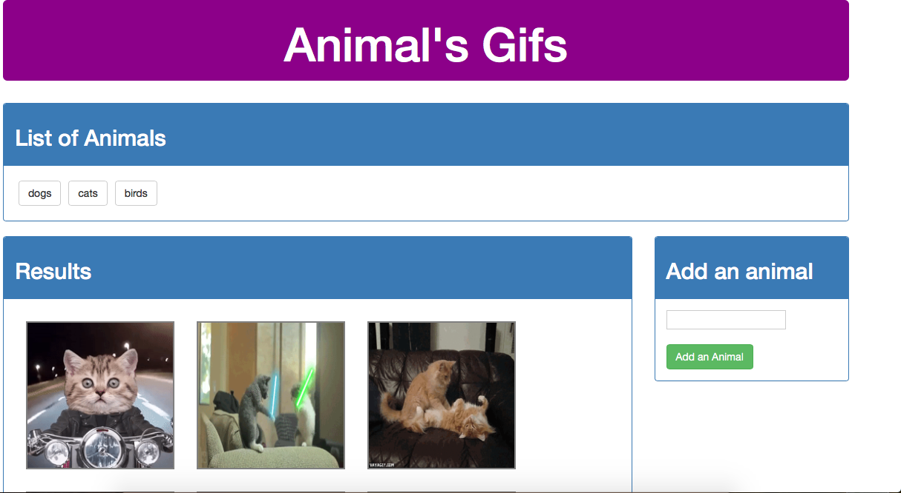
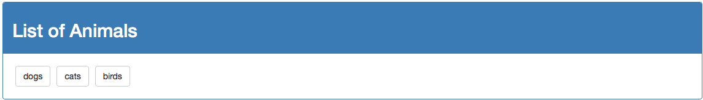
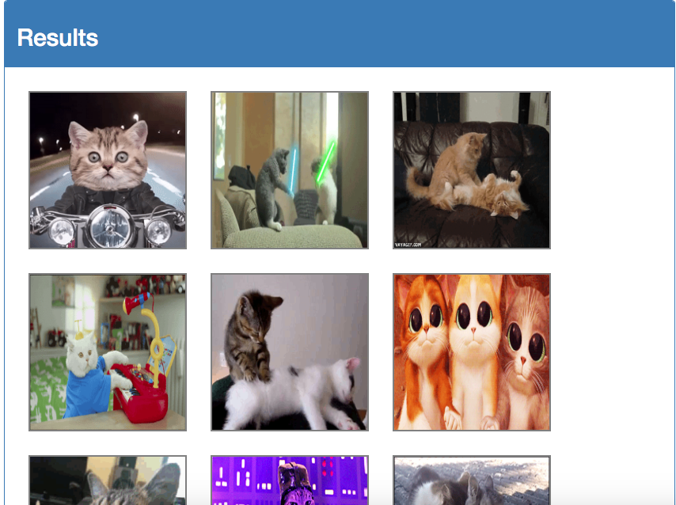
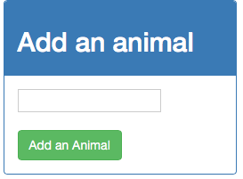

# Giphy app

## What is it?
A fun app that allow to request and show funny gifs, build with Bootstrap, jQuery and Ajax.

The application provides 3 main sections:

	* List of Animals
	* Add Animal
	* Results

Refer to the [**Show Me**](#show-me) section below for examples on how to use each of the views.

## How do I use it?

Clone this repository.

Then, open in browser:

`index.html`

## Show Me

After opening `index.html` in browser, you will be presented with the app home page.

## List of Animals

In this section you will find a list of buttons which you can click and the app will make an api request to retrieve gifs relative to button text animal.

## Results

After clicking in an animal button the app will present you a list of static gifs in the Results section.

You can also click on each animal gif to make them MOVE!!!.

## Add Animal

Want more? You can add more animals by providing and animal name in the input box and click on "Add an Animal" button in Add Animal section.

